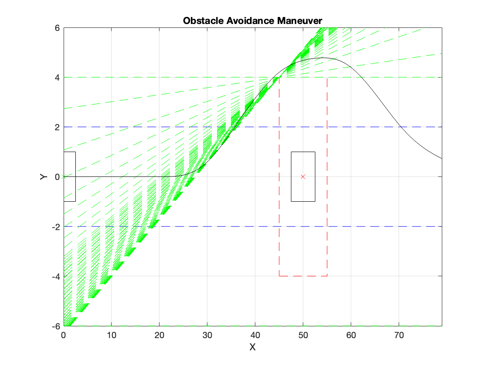
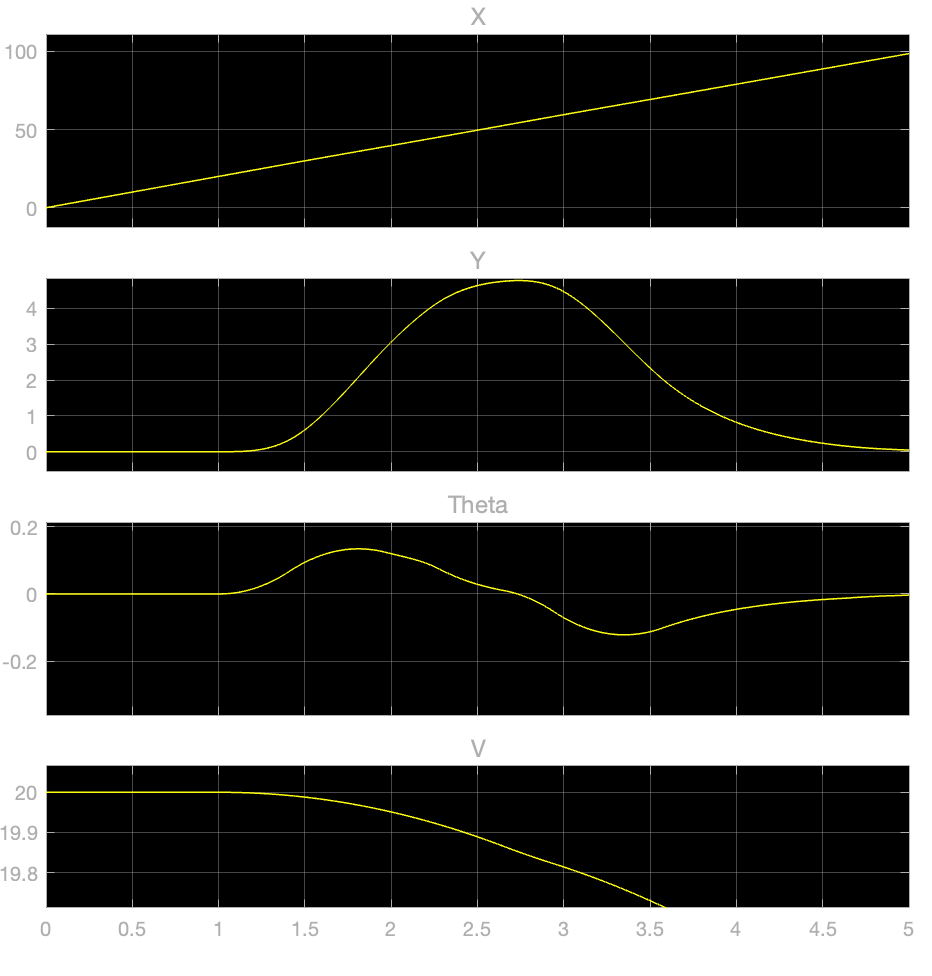
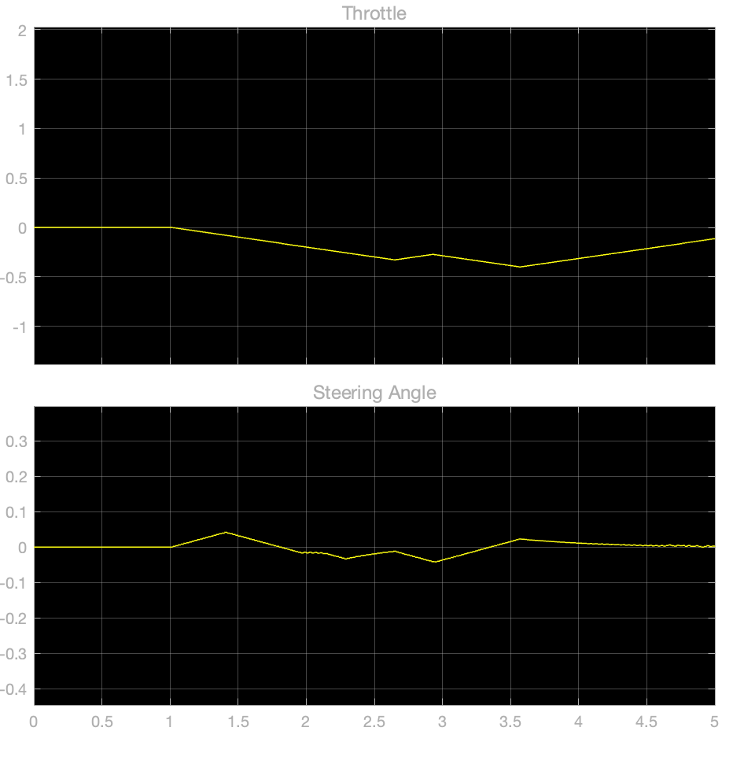

# MPC Controller To Avoid Obstacles

## Introduction

Model Predictive Control (MPC) is a powerful control technique widely used in various applications, including autonomous vehicles, robotics, and process control. In this project, we utilize MPC to design an obstacle avoidance system for an ego vehicle navigating within predefined lanes. The goal is to develop a robust and adaptive control strategy that enables the vehicle to navigate safely in complex environments with dynamic obstacles.

## Components

The simulation comprises the following key components:

1. **Ego Vehicle Dynamics:**
   - The ego vehicle's dynamics are modeled using a discrete-time representation, which captures its position (x, y), orientation (theta), and velocity. These dynamics serve as the foundation for predicting the vehicle's future states and generating control inputs.

2. **Obstacle Representation:**
   - Obstacles in the environment are represented by their dimensions and positions relative to the ego vehicle. The simulation includes functions to detect obstacles and compute custom constraints for obstacle avoidance. These constraints are crucial for ensuring that the vehicle maintains a safe distance from obstacles while adhering to predefined lanes.

3. **Mixed I/O Constraints:**
   - Custom I/O constraints are implemented to enforce safe navigation behavior. These constraints incorporate information about obstacle detection and lane boundaries to dynamically adjust the control inputs generated by the MPC controller. By integrating mixed I/O constraints into the control framework, we can effectively mitigate collision risks and ensure smooth trajectory tracking.

4. **Adaptive MPC Controller:**
   - An adaptive MPC controller is designed to optimize the vehicle's trajectory while accounting for dynamic changes in the environment. The controller utilizes predictive models of the ego vehicle and its surroundings to anticipate future states and compute optimal control inputs. Through iterative optimization, the MPC controller adjusts its parameters to adapt to varying operating conditions and achieve robust obstacle avoidance performance.

5. **Simulation Visualization:**
   - The simulation results are visualized using MATLAB plots and a Simulink model. The plots provide insights into the ego vehicle's trajectory, obstacle avoidance behavior, and the evolution of mixed I/O constraints over time. Additionally, the Simulink model offers a graphical representation of the vehicle's motion, allowing for intuitive analysis and validation of the control system's performance.

## Functions

The simulation employs the following functions:

1. **`discreteModel.m`:**
   - Defines the dynamics of the ego vehicle in discrete-time.
   
2. **`initialPlot.m`:**
   - Plots the initial condition of the ego vehicle and the obstacles.
   
3. **`createObstacle.m`:**
   - Generates geometry information for the obstacles.
   
4. **`detectObstacles.m`:**
   - Detects obstacles in the vicinity of the ego vehicle.
   
5. **`computeObstacleConstraints.m`:**
   - Computes custom constraints based on obstacle detection.
   
6. **`main.m`:**
   - Orchestrates the simulation process by integrating the aforementioned functions.

These functions collectively form the backbone of the MPC-based obstacle avoidance simulation, providing a systematic framework for modeling, control, and visualization. By modularizing functionality and encapsulating domain-specific logic within individual functions, the simulation architecture promotes code reusability, maintainability, and extensibility.

## Usage

To run the simulation:

1. Ensure you have MATLAB installed on your system.
2. Clone or download this repository to your local machine.
3. Open MATLAB and navigate to the directory containing the downloaded files.
4. Execute the `main.m` script to start the simulation.

## Results

Upon running the simulation, you will observe:

- Plot of the ego vehicle's trajectory and obstacle avoidance behavior.
  
- Visualization of the simulation in the Simulink model, showing the ego vehicle's motion and interaction with obstacles.
  
  

## Future Improvements

Potential enhancements to the simulation include:

- Integration of sensor data for real-time obstacle detection and environment perception.
- Implementation of advanced control algorithms, such as reinforcement learning or deep learning-based approaches, for improved decision-making and trajectory planning.
- Optimization of the MPC controller parameters to achieve optimal performance in various scenarios and environments.

## References

- This project was developed with the assistance of MathWorks resources.
